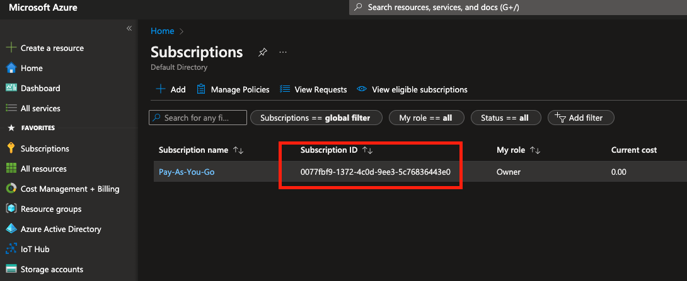
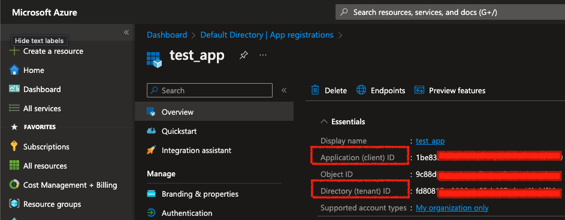
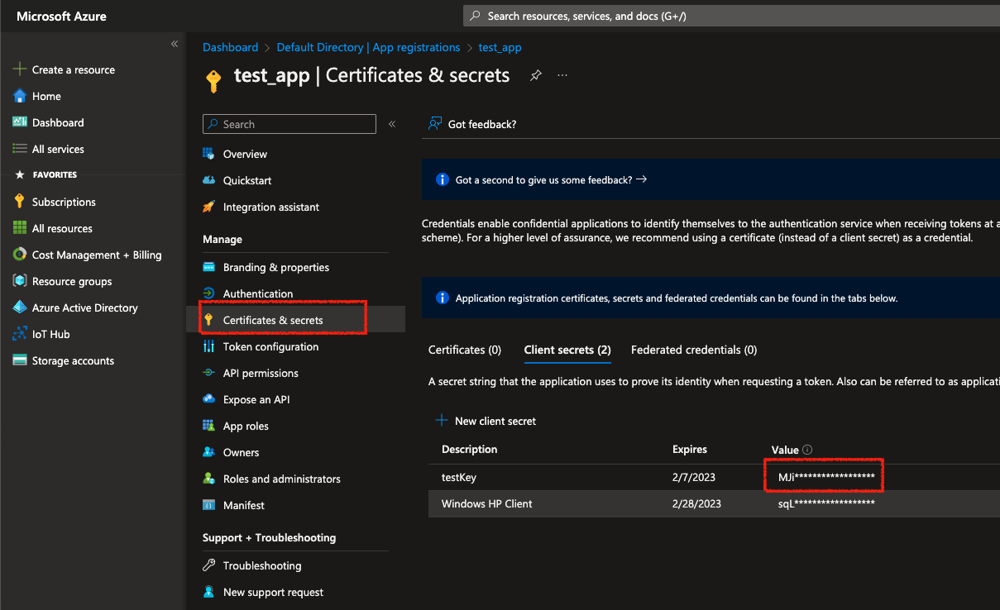

# Azure IoT Development Guide

## Prerequisites
### 1. Create an Azure account 

Create an azure account as explained in https://azure.microsoft.com/en-us/free/ by selecting either *free* or *pay-as-you-go* options.
Remember *free* version is only valid for 12 Months.

### 2. Create a subscription
If you don't have a subscription already create a subscription in https://portal.azure.com/#view/Microsoft_Azure_Billing/SubscriptionsBlade like below. Note the 'subscriptionId'




### 3. Register an app and get the clientId, tenantId
After you sign up and sign in to azure portal, create an app in [Azure Active Directory](https://portal.azure.com/#view/Microsoft_AAD_IAM/ActiveDirectoryMenuBlade/~/RegisteredApps) as seen below. Note the *clientId* aka *applicationId* and *tenantId*.



### 4. Create a client secret for the created app
Once the app is created, click to the app created(in our case it is called *test_app*) in [Azure Active Directory/App registrations](https://portal.azure.com/#view/Microsoft_AAD_IAM/ActiveDirectoryMenuBlade/~/RegisteredApps) and navigate to Certificates & Secrets. Create a client secret and note the *value*.




### 5. Create environment variables
Create environment variables as below. Replace the values with the correct ones.

````
export AZURE_SUBSCRIPTION_ID='0077xxxxxxxxxxxxxxxxxxxxxxxxx'
export AZURE_CLIENT_ID='0077xxxxxxxxxxxxxxxxxxxxxxxxx'
export AZURE_TENANT_ID=''0077xxxxxxxxxxxxxxxxxxxxxxxxx'
export AZURE_CLIENT_SECRET='0077xxxxxxxxxxxxxxxxxxxxxxxxx'
````


## How to run
`./gradlew run --args='server build/resources/main/serverConfig.yml'`

`java -cp ":build/libs/all-in-one-jar-1.0-SNAPSHOT.jar" -jar build/libs/all-in-one-jar-1.0-SNAPSHOT.jar`

java -cp ":build/classes/java/main" -jar build/libs/all-in-one-jar-1.0-SNAPSHOT.jar

java -cp ":build/classes/java/main:build/libs/all-in-one-jar-1.0-SNAPSHOT.jar" com/maibornwolff/azure/iot/ResourceManager

java -cp ":build/classes/java/main:build/libs/all-in-one-jar-1.0-SNAPSHOT.jar" com.maibornwolff.azure.iotHub.ResourceManager


## IoT Hub

### Device Management

#### Device Identity Management

##### Importing device identities to IoT HUB a.k.a Device Registry in Bulk


##


## Refernece
- https://docs.microsoft.com/en-us/java/api/overview/azure/resourcemanager-iothub-readme?view=azure-java-stable
- https://www.inkoop.io/blog/how-to-get-azure-api-credentials/